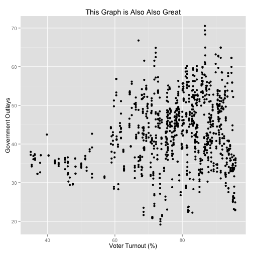

% Graphics in R
% [Chris Krogslund](http://ckro.gs); [Political Science](http://polisci.berkeley.edu) // [D-Lab](http://dlab.berkeley.edu) // [UC Berkeley](http://www.berkeley.edu/)
% [ckrogslund@berkeley.edu](mailto:ckrogslund@berkeley.edu)


# By way of introduction...

* 3 main facilities for producing graphics in R: **base**, **lattice**, and **ggplot2**
  * In practice, these facilities are grouped into two camps: "basic" and "advanced"
* A better formulation: quick/dirty v. involved/fancy

# quick/dirty v. involved/fancy

* Recall that R is an object-oriented programming language


```r
tips <- reshape2::tips  # Load dataset on tipping behavior included with reshape2 package
attributes(tips)  # Check attributes of the tips dataset (names, row.names, class)
```

```
## $names
## [1] "total_bill" "tip"        "sex"        "smoker"     "day"       
## [6] "time"       "size"      
## 
## $row.names
##   [1] "1"   "2"   "3"   "4"   "5"   "6"   "7"   "8"   "9"   "10"  "11" 
##  [12] "12"  "13"  "14"  "15"  "16"  "17"  "18"  "19"  "20"  "21"  "22" 
##  [23] "23"  "24"  "25"  "26"  "27"  "28"  "29"  "30"  "31"  "32"  "33" 
##  [34] "34"  "35"  "36"  "37"  "38"  "39"  "40"  "41"  "42"  "43"  "44" 
##  [45] "45"  "46"  "47"  "48"  "49"  "50"  "51"  "52"  "53"  "54"  "55" 
##  [56] "56"  "57"  "58"  "59"  "60"  "61"  "62"  "63"  "64"  "65"  "66" 
##  [67] "67"  "68"  "69"  "70"  "71"  "72"  "73"  "74"  "75"  "76"  "77" 
##  [78] "78"  "79"  "80"  "81"  "82"  "83"  "84"  "85"  "86"  "87"  "88" 
##  [89] "89"  "90"  "91"  "92"  "93"  "94"  "95"  "96"  "97"  "98"  "99" 
## [100] "100" "101" "102" "103" "104" "105" "106" "107" "108" "109" "110"
## [111] "111" "112" "113" "114" "115" "116" "117" "118" "119" "120" "121"
## [122] "122" "123" "124" "125" "126" "127" "128" "129" "130" "131" "132"
## [133] "133" "134" "135" "136" "137" "138" "139" "140" "141" "142" "143"
## [144] "144" "145" "146" "147" "148" "149" "150" "151" "152" "153" "154"
## [155] "155" "156" "157" "158" "159" "160" "161" "162" "163" "164" "165"
## [166] "166" "167" "168" "169" "170" "171" "172" "173" "174" "175" "176"
## [177] "177" "178" "179" "180" "181" "182" "183" "184" "185" "186" "187"
## [188] "188" "189" "190" "191" "192" "193" "194" "195" "196" "197" "198"
## [199] "199" "200" "201" "202" "203" "204" "205" "206" "207" "208" "209"
## [210] "210" "211" "212" "213" "214" "215" "216" "217" "218" "219" "220"
## [221] "221" "222" "223" "224" "225" "226" "227" "228" "229" "230" "231"
## [232] "232" "233" "234" "235" "236" "237" "238" "239" "240" "241" "242"
## [243] "243" "244"
## 
## $class
## [1] "data.frame"
```

```r
# Create an object of class 'lm' (linear model), regressing tip on some
# covariates
tips.reg <- lm(formula = tip ~ total_bill + sex + smoker + day + time + size, 
    data = tips)
attributes(tips.reg)  # Check attributes of the tips.reg object (names, class)
```

```
## $names
##  [1] "coefficients"  "residuals"     "effects"       "rank"         
##  [5] "fitted.values" "assign"        "qr"            "df.residual"  
##  [9] "contrasts"     "xlevels"       "call"          "terms"        
## [13] "model"        
## 
## $class
## [1] "lm"
```


* Base graphics often recognizes the object type and will implement specific plot methods


```r
plot(tips)  # Calls plotting method for class of tips dataset ('data.frame')
```

 

```r
plot(tips.reg, which = 1:2)  # Calls plotting method for class of tips.reg objects ('lm'), print first two plots only
```

  


* lattice and ggplot2 generally **don't** exhibit this sort of behavior

```r
xyplot(tips)  # Attempt in lattice to automatically plot objects of class 'data.frame'
```

```
## Error: no applicable method for 'xyplot' applied to an object of class
## "data.frame"
```

```r
ggplot(data = tips) + geom_point()  # Attempt in ggplot to automatically plot objects of class 'data.frame'
```

```
## Error: 'where' is missing
```

```r
xyplot(tips.reg)  # Attempt in lattice to automatically plot objects of class 'lm'
```

```
## Error: no applicable method for 'xyplot' applied to an object of class
## "lm"
```

```r
ggplot(data = tips.reg) + geom_point()  # Attempt in ggplot to automatically plot objects of class 'lm'
```

```
## Error: 'where' is missing
```


* Easiest to cover **base** graphics on its own, but **lattice** and **ggplot2** in tandem 

# The Dataset

* **Comparative Political Data Set I** (Armingeon et al. 2012)
* Cases: 23 industrialized democracies, 1960-2012
* Variables: *Government composition* (L-R); *state structure* (federalism, presidentialism, bicameralism, etc.); *macroeconomic indicators* (output, inflation, unemployment, deficit/debt, etc.); *demographics* (population, elderly)

For more info: [http://www.ipw.unibe.ch/content/team/klaus_armingeon/comparative_political_data_sets/index_eng.html](http://www.ipw.unibe.ch/content/team/klaus_armingeon/comparative_political_data_sets/index_eng.html)

A copy of the dataset is available in the file "cpds.csv", which can be read in as:


```r
data <- read.csv(file = "cpds.csv")
```


# The Dataset, more specifically


```r
attributes(data)[1:2]  # Only show the first two attributes of the dataset (column names and object class)
```

```
## $names
##   [1] "year"         "country"      "countryn"     "gov_right"   
##   [5] "gov_cent"     "gov_left"     "govparty"     "gov_new"     
##   [9] "gov_gap"      "gov_type"     "gov_chan"     "elect"       
##  [13] "vturn"        "social1"      "social2"      "social3"     
##  [17] "social4"      "leftsoc1"     "leftsoc2"     "leftsoc3"    
##  [21] "comm1"        "comm2"        "comm3"        "comm4"       
##  [25] "agrarian"     "conserv1"     "conserv2"     "conserv3"    
##  [29] "conserv4"     "conserv5"     "relig1"       "relig2"      
##  [33] "relig3"       "relig4"       "relig5"       "relig6"      
##  [37] "relig7"       "liberal1"     "liberal2"     "liberal3"    
##  [41] "liberal4"     "liberal5"     "liberal6"     "ultrar1"     
##  [45] "ultrar2"      "protest1"     "protest2"     "protest3"    
##  [49] "protest4"     "green1"       "green2"       "green3"      
##  [53] "ethnic1"      "ethnic2"      "ethnic3"      "ethnic4"     
##  [57] "leftall"      "centall"      "rightall"     "others"      
##  [61] "VAR00017"     "VAR00019"     "ssocial1"     "ssocial2"    
##  [65] "ssocial3"     "ssocial4"     "sleftso1"     "sleftso2"    
##  [69] "sleftso3"     "scomm1"       "scomm2"       "scomm3"      
##  [73] "scomm4"       "sagraria"     "sconser1"     "sconser2"    
##  [77] "sconser3"     "sconser4"     "sconser5"     "srelig1"     
##  [81] "srelig2"      "srelig3"      "srelig4"      "srelig5"     
##  [85] "srelig6"      "srelig7"      "slibera1"     "slibera2"    
##  [89] "slibera3"     "slibera4"     "slibera5"     "slibera6"    
##  [93] "sultrar1"     "sultrar2"     "sprotes1"     "sprotes2"    
##  [97] "sprotes3"     "sprotes4"     "sgreen1"      "sgreen2"     
## [101] "sgreen3"      "sethnic1"     "sethnic2"     "sethnic3"    
## [105] "sethnic4"     "sleftal"      "scental"      "srightal"    
## [109] "sothers"      "VAR00018"     "VAR00020"     "womenpar"    
## [113] "rae_ele"      "rae_leg"      "effpar_ele"   "effpar_leg"  
## [117] "dis_abso"     "dis_rel"      "dis_gall"     "var00001"    
## [121] "var00002"     "lfirst1"      "lfirst2"      "lsec1"       
## [125] "lsec2"        "leff1"        "leff2"        "lmin1"       
## [129] "lmin2"        "lexe1"        "lexe2"        "ldis1"       
## [133] "ldis2"        "lint1"        "lint2"        "lfed1"       
## [137] "lfed2"        "lbic1"        "lbic2"        "lrid1"       
## [141] "lrid2"        "ljud1"        "ljud2"        "lbank1"      
## [145] "lbank2"       "lfirstp"      "lfirstpi"     "lfirstpb"    
## [149] "var00003"     "var00008"     "instcons"     "plural"      
## [153] "structur"     "integr"       "fed"          "pres"        
## [157] "singmemd"     "strbic"       "referen"      "judrev"      
## [161] "VAR00015"     "VAR00016"     "kaopen"       "openc"       
## [165] "outlays"      "receipts"     "realgdpgr"    "nomgdpgr"    
## [169] "inflation"    "debt"         "deficit"      "adjustdef"   
## [173] "interest"     "VAR00013"     "VAR00014"     "ttl_labf"    
## [177] "civ_labf"     "emp_civ"      "labfopar"     "empratio"    
## [181] "emp_ag"       "emp_ind"      "emp_serv"     "emp_un"      
## [185] "unemp"        "st_unemp"     "var00005"     "var00004"    
## [189] "nld"          "wi"           "wdlost"       "strike"      
## [193] "grossu"       "netu"         "ud"           "adjcov"      
## [197] "VAR00027"     "VAR00028"     "sstran"       "socexp_t_pmp"
## [201] "socexp_c_pmp" "socexp_k_pmp" "oldage_pmp"   "survivor_pmp"
## [205] "incapben_pmp" "health_pmp"   "family_pmp"   "almp_pmp"    
## [209] "unemp_pmp"    "housing_pmp"  "othsocx_pmp"  "var00007"    
## [213] "var00006"     "fallow_pmp"   "mpleave_pmp"  "othfam_c_pmp"
## [217] "daycare_pmp"  "othfam_k_pmp" "VAR00047"     "VAR00048"    
## [221] "servadmi_pmp" "training_pmp" "jobrot_pmp"   "incent_pmp"  
## [225] "disabled_pmp" "jobcrea_pmp"  "startup_pmp"  "compen_pmp"  
## [229] "earretir_pmp" "emprot"       "VAR00009"     "VAR00010"    
## [233] "ilo_tot"      "pop"          "pop15_64"     "pop65"       
## [237] "elderly"     
## 
## $class
## [1] "data.frame"
```

```r
# There are many variables, so it can be helpful to extract their classes
# (mostly to check for factors) via a quick for-loop

classes <- NULL  # Create a placeholder for the class output

# for-loop
for (i in 1:ncol(data)) {
    classes <- c(classes, class(data[, i]))
}
sort(classes)  # Sort the results alphabetically (appears to be some factors, a few integers, and many numerics)
```

```
##   [1] "factor"  "factor"  "factor"  "factor"  "factor"  "factor"  "factor" 
##   [8] "factor"  "factor"  "factor"  "factor"  "factor"  "factor"  "integer"
##  [15] "integer" "integer" "integer" "integer" "integer" "integer" "integer"
##  [22] "integer" "integer" "integer" "integer" "integer" "integer" "integer"
##  [29] "integer" "integer" "integer" "integer" "integer" "integer" "integer"
##  [36] "integer" "integer" "integer" "integer" "integer" "integer" "integer"
##  [43] "integer" "integer" "integer" "integer" "numeric" "numeric" "numeric"
##  [50] "numeric" "numeric" "numeric" "numeric" "numeric" "numeric" "numeric"
##  [57] "numeric" "numeric" "numeric" "numeric" "numeric" "numeric" "numeric"
##  [64] "numeric" "numeric" "numeric" "numeric" "numeric" "numeric" "numeric"
##  [71] "numeric" "numeric" "numeric" "numeric" "numeric" "numeric" "numeric"
##  [78] "numeric" "numeric" "numeric" "numeric" "numeric" "numeric" "numeric"
##  [85] "numeric" "numeric" "numeric" "numeric" "numeric" "numeric" "numeric"
##  [92] "numeric" "numeric" "numeric" "numeric" "numeric" "numeric" "numeric"
##  [99] "numeric" "numeric" "numeric" "numeric" "numeric" "numeric" "numeric"
## [106] "numeric" "numeric" "numeric" "numeric" "numeric" "numeric" "numeric"
## [113] "numeric" "numeric" "numeric" "numeric" "numeric" "numeric" "numeric"
## [120] "numeric" "numeric" "numeric" "numeric" "numeric" "numeric" "numeric"
## [127] "numeric" "numeric" "numeric" "numeric" "numeric" "numeric" "numeric"
## [134] "numeric" "numeric" "numeric" "numeric" "numeric" "numeric" "numeric"
## [141] "numeric" "numeric" "numeric" "numeric" "numeric" "numeric" "numeric"
## [148] "numeric" "numeric" "numeric" "numeric" "numeric" "numeric" "numeric"
## [155] "numeric" "numeric" "numeric" "numeric" "numeric" "numeric" "numeric"
## [162] "numeric" "numeric" "numeric" "numeric" "numeric" "numeric" "numeric"
## [169] "numeric" "numeric" "numeric" "numeric" "numeric" "numeric" "numeric"
## [176] "numeric" "numeric" "numeric" "numeric" "numeric" "numeric" "numeric"
## [183] "numeric" "numeric" "numeric" "numeric" "numeric" "numeric" "numeric"
## [190] "numeric" "numeric" "numeric" "numeric" "numeric" "numeric" "numeric"
## [197] "numeric" "numeric" "numeric" "numeric" "numeric" "numeric" "numeric"
## [204] "numeric" "numeric" "numeric" "numeric" "numeric" "numeric" "numeric"
## [211] "numeric" "numeric" "numeric" "numeric" "numeric" "numeric" "numeric"
## [218] "numeric" "numeric" "numeric" "numeric" "numeric" "numeric" "numeric"
## [225] "numeric" "numeric" "numeric" "numeric" "numeric" "numeric" "numeric"
## [232] "numeric" "numeric" "numeric" "numeric" "numeric" "numeric"
```


# base

* *Minimal* call takes the following form


```r
plot(x = )
```


* Note that data-bearing arguments of length creater than 1 ("x" in this case) must be *vectorized* in some manner (usually using the '$' column vector method)


```r
plot(x = vturn)  # Attempt to plot variable 'vturn' without vectorization
```

```
## Error: object 'vturn' not found
```

```r
plot(x = data$vturn)  # Attempt to plot variable 'vturn' with '$' vectorization
```

 


* *Basic* call takes the following form


```r
plot(x = , y = , type = "")
```


# base/type (scatter, line, both)

* The "type" argument accepts the following character indicators
* "p" -- point/scatter plots (default plotting behavior)

```r
plot(x = data$year, y = data$realgdpgr, type = "p")  # Plot Year on x-axis and Real GDP Growth on y-axis
```

 

* "l" -- line graphs

```r
plot(x = data$year, y = data$realgdpgr, type = "l")  # Plot Year on x-axis and Real GDP Growth on y-axis
```

 

* "b" -- both line and point plots

```r
plot(x = data$year, y = data$realgdpgr, type = "b")  # Plot Year on x-axis and Real GDP Growth on y-axis
```

 


# base/type (histograms, density plots)

* Certain plot types require different calls outside of the "type" argument
* Ex) Histograms

```r
hist(x = data$vturn)  # Plot histogram of voter turnout 
```

 

```r
hist(x = data$vturn, breaks = 2)  # Plot histogram of voter turnout, with 2 breaks
```

 

```r
hist(x = data$vturn, breaks = 50)  # Plot histogram of voter turnout, with 50 breaks
```

 

* Ex) Density plots

```r
vturn.density <- density(x = data$vturn, na.rm = T)  # Create a density object (NOTE: be sure to remove missing values)
class(vturn.density)  # Check the class of the object
```

```
## [1] "density"
```

```r
vturn.density  # View the contents of the object
```

```
## 
## Call:
## 	density.default(x = data$vturn, na.rm = T)
## 
## Data: data$vturn (1134 obs.);	Bandwidth 'bw' = 2.826
## 
##        x               y          
##  Min.   : 26.5   Min.   :0.00001  
##  1st Qu.: 46.0   1st Qu.:0.00248  
##  Median : 65.4   Median :0.00626  
##  Mean   : 65.4   Mean   :0.01285  
##  3rd Qu.: 84.8   3rd Qu.:0.02472  
##  Max.   :104.3   Max.   :0.03609
```

```r
plot(x = vturn.density)  # Plot the density object
```

 

```r
plot(x = density(x = data$vturn, bw = 2, na.rm = T))  # Plot the density object, bandwidth of 2
```

 

```r
plot(x = density(x = data$vturn, bw = 0.5, na.rm = T))  # Plot the density object, bandwidth of 0.5
```

 

```r
plot(x = density(x = data$vturn, bw = 6, na.rm = T))  # Plot the density object, bandwidth of 6
```

 


# base/options [labeling]

* Basic call with popular labeling arguments

```r
plot(x = , y = , type = "", xlab = "", ylab = "", main = "")
```

* From the previous example


```r
plot(x = data$year, y = data$realgdpgr, type = "p", xlab = "Year", ylab = "Real GDP Growth", 
    main = "This Graph is Great")  # Add labels for axes and overall plot
```

 


# base/options [axis + size scaling]

* Basic call with popular scaling arguments

```r
plot(x = , y = , type = "", xlim = , ylim = , cex = )
```

* From the previous example


```r
plot(x = data$year, y = data$realgdpgr, type = "p")  # Create a basic plot
```

 

```r
# Limit the years (x-axis) to between 1976 and 1991
plot(x = data$year, y = data$realgdpgr, type = "p", xlim = c(1976, 1991))
```

 

```r
# Limit the years (x-axis) to between 1976 and 1991, increase point size to
# 2
plot(x = data$year, y = data$realgdpgr, type = "p", xlim = c(1976, 1991), cex = 2)
```

 

```r
# Limit the years (x-axis) to between 1976 and 1991, decrease point size to
# 0.5
plot(x = data$year, y = data$realgdpgr, type = "p", xlim = c(1976, 1991), cex = 0.5)
```

 


# base/options [graphical parameters]

* Basic call with popular scaling arguments

```r
plot(x = , y = , type = "", col = "", pch = , lty = , lwd = )
```

* Colors

```r
colors()  # View all elements of the color vector
```

```
##   [1] "white"                "aliceblue"            "antiquewhite"        
##   [4] "antiquewhite1"        "antiquewhite2"        "antiquewhite3"       
##   [7] "antiquewhite4"        "aquamarine"           "aquamarine1"         
##  [10] "aquamarine2"          "aquamarine3"          "aquamarine4"         
##  [13] "azure"                "azure1"               "azure2"              
##  [16] "azure3"               "azure4"               "beige"               
##  [19] "bisque"               "bisque1"              "bisque2"             
##  [22] "bisque3"              "bisque4"              "black"               
##  [25] "blanchedalmond"       "blue"                 "blue1"               
##  [28] "blue2"                "blue3"                "blue4"               
##  [31] "blueviolet"           "brown"                "brown1"              
##  [34] "brown2"               "brown3"               "brown4"              
##  [37] "burlywood"            "burlywood1"           "burlywood2"          
##  [40] "burlywood3"           "burlywood4"           "cadetblue"           
##  [43] "cadetblue1"           "cadetblue2"           "cadetblue3"          
##  [46] "cadetblue4"           "chartreuse"           "chartreuse1"         
##  [49] "chartreuse2"          "chartreuse3"          "chartreuse4"         
##  [52] "chocolate"            "chocolate1"           "chocolate2"          
##  [55] "chocolate3"           "chocolate4"           "coral"               
##  [58] "coral1"               "coral2"               "coral3"              
##  [61] "coral4"               "cornflowerblue"       "cornsilk"            
##  [64] "cornsilk1"            "cornsilk2"            "cornsilk3"           
##  [67] "cornsilk4"            "cyan"                 "cyan1"               
##  [70] "cyan2"                "cyan3"                "cyan4"               
##  [73] "darkblue"             "darkcyan"             "darkgoldenrod"       
##  [76] "darkgoldenrod1"       "darkgoldenrod2"       "darkgoldenrod3"      
##  [79] "darkgoldenrod4"       "darkgray"             "darkgreen"           
##  [82] "darkgrey"             "darkkhaki"            "darkmagenta"         
##  [85] "darkolivegreen"       "darkolivegreen1"      "darkolivegreen2"     
##  [88] "darkolivegreen3"      "darkolivegreen4"      "darkorange"          
##  [91] "darkorange1"          "darkorange2"          "darkorange3"         
##  [94] "darkorange4"          "darkorchid"           "darkorchid1"         
##  [97] "darkorchid2"          "darkorchid3"          "darkorchid4"         
## [100] "darkred"              "darksalmon"           "darkseagreen"        
## [103] "darkseagreen1"        "darkseagreen2"        "darkseagreen3"       
## [106] "darkseagreen4"        "darkslateblue"        "darkslategray"       
## [109] "darkslategray1"       "darkslategray2"       "darkslategray3"      
## [112] "darkslategray4"       "darkslategrey"        "darkturquoise"       
## [115] "darkviolet"           "deeppink"             "deeppink1"           
## [118] "deeppink2"            "deeppink3"            "deeppink4"           
## [121] "deepskyblue"          "deepskyblue1"         "deepskyblue2"        
## [124] "deepskyblue3"         "deepskyblue4"         "dimgray"             
## [127] "dimgrey"              "dodgerblue"           "dodgerblue1"         
## [130] "dodgerblue2"          "dodgerblue3"          "dodgerblue4"         
## [133] "firebrick"            "firebrick1"           "firebrick2"          
## [136] "firebrick3"           "firebrick4"           "floralwhite"         
## [139] "forestgreen"          "gainsboro"            "ghostwhite"          
## [142] "gold"                 "gold1"                "gold2"               
## [145] "gold3"                "gold4"                "goldenrod"           
## [148] "goldenrod1"           "goldenrod2"           "goldenrod3"          
## [151] "goldenrod4"           "gray"                 "gray0"               
## [154] "gray1"                "gray2"                "gray3"               
## [157] "gray4"                "gray5"                "gray6"               
## [160] "gray7"                "gray8"                "gray9"               
## [163] "gray10"               "gray11"               "gray12"              
## [166] "gray13"               "gray14"               "gray15"              
## [169] "gray16"               "gray17"               "gray18"              
## [172] "gray19"               "gray20"               "gray21"              
## [175] "gray22"               "gray23"               "gray24"              
## [178] "gray25"               "gray26"               "gray27"              
## [181] "gray28"               "gray29"               "gray30"              
## [184] "gray31"               "gray32"               "gray33"              
## [187] "gray34"               "gray35"               "gray36"              
## [190] "gray37"               "gray38"               "gray39"              
## [193] "gray40"               "gray41"               "gray42"              
## [196] "gray43"               "gray44"               "gray45"              
## [199] "gray46"               "gray47"               "gray48"              
## [202] "gray49"               "gray50"               "gray51"              
## [205] "gray52"               "gray53"               "gray54"              
## [208] "gray55"               "gray56"               "gray57"              
## [211] "gray58"               "gray59"               "gray60"              
## [214] "gray61"               "gray62"               "gray63"              
## [217] "gray64"               "gray65"               "gray66"              
## [220] "gray67"               "gray68"               "gray69"              
## [223] "gray70"               "gray71"               "gray72"              
## [226] "gray73"               "gray74"               "gray75"              
## [229] "gray76"               "gray77"               "gray78"              
## [232] "gray79"               "gray80"               "gray81"              
## [235] "gray82"               "gray83"               "gray84"              
## [238] "gray85"               "gray86"               "gray87"              
## [241] "gray88"               "gray89"               "gray90"              
## [244] "gray91"               "gray92"               "gray93"              
## [247] "gray94"               "gray95"               "gray96"              
## [250] "gray97"               "gray98"               "gray99"              
## [253] "gray100"              "green"                "green1"              
## [256] "green2"               "green3"               "green4"              
## [259] "greenyellow"          "grey"                 "grey0"               
## [262] "grey1"                "grey2"                "grey3"               
## [265] "grey4"                "grey5"                "grey6"               
## [268] "grey7"                "grey8"                "grey9"               
## [271] "grey10"               "grey11"               "grey12"              
## [274] "grey13"               "grey14"               "grey15"              
## [277] "grey16"               "grey17"               "grey18"              
## [280] "grey19"               "grey20"               "grey21"              
## [283] "grey22"               "grey23"               "grey24"              
## [286] "grey25"               "grey26"               "grey27"              
## [289] "grey28"               "grey29"               "grey30"              
## [292] "grey31"               "grey32"               "grey33"              
## [295] "grey34"               "grey35"               "grey36"              
## [298] "grey37"               "grey38"               "grey39"              
## [301] "grey40"               "grey41"               "grey42"              
## [304] "grey43"               "grey44"               "grey45"              
## [307] "grey46"               "grey47"               "grey48"              
## [310] "grey49"               "grey50"               "grey51"              
## [313] "grey52"               "grey53"               "grey54"              
## [316] "grey55"               "grey56"               "grey57"              
## [319] "grey58"               "grey59"               "grey60"              
## [322] "grey61"               "grey62"               "grey63"              
## [325] "grey64"               "grey65"               "grey66"              
## [328] "grey67"               "grey68"               "grey69"              
## [331] "grey70"               "grey71"               "grey72"              
## [334] "grey73"               "grey74"               "grey75"              
## [337] "grey76"               "grey77"               "grey78"              
## [340] "grey79"               "grey80"               "grey81"              
## [343] "grey82"               "grey83"               "grey84"              
## [346] "grey85"               "grey86"               "grey87"              
## [349] "grey88"               "grey89"               "grey90"              
## [352] "grey91"               "grey92"               "grey93"              
## [355] "grey94"               "grey95"               "grey96"              
## [358] "grey97"               "grey98"               "grey99"              
## [361] "grey100"              "honeydew"             "honeydew1"           
## [364] "honeydew2"            "honeydew3"            "honeydew4"           
## [367] "hotpink"              "hotpink1"             "hotpink2"            
## [370] "hotpink3"             "hotpink4"             "indianred"           
## [373] "indianred1"           "indianred2"           "indianred3"          
## [376] "indianred4"           "ivory"                "ivory1"              
## [379] "ivory2"               "ivory3"               "ivory4"              
## [382] "khaki"                "khaki1"               "khaki2"              
## [385] "khaki3"               "khaki4"               "lavender"            
## [388] "lavenderblush"        "lavenderblush1"       "lavenderblush2"      
## [391] "lavenderblush3"       "lavenderblush4"       "lawngreen"           
## [394] "lemonchiffon"         "lemonchiffon1"        "lemonchiffon2"       
## [397] "lemonchiffon3"        "lemonchiffon4"        "lightblue"           
## [400] "lightblue1"           "lightblue2"           "lightblue3"          
## [403] "lightblue4"           "lightcoral"           "lightcyan"           
## [406] "lightcyan1"           "lightcyan2"           "lightcyan3"          
## [409] "lightcyan4"           "lightgoldenrod"       "lightgoldenrod1"     
## [412] "lightgoldenrod2"      "lightgoldenrod3"      "lightgoldenrod4"     
## [415] "lightgoldenrodyellow" "lightgray"            "lightgreen"          
## [418] "lightgrey"            "lightpink"            "lightpink1"          
## [421] "lightpink2"           "lightpink3"           "lightpink4"          
## [424] "lightsalmon"          "lightsalmon1"         "lightsalmon2"        
## [427] "lightsalmon3"         "lightsalmon4"         "lightseagreen"       
## [430] "lightskyblue"         "lightskyblue1"        "lightskyblue2"       
## [433] "lightskyblue3"        "lightskyblue4"        "lightslateblue"      
## [436] "lightslategray"       "lightslategrey"       "lightsteelblue"      
## [439] "lightsteelblue1"      "lightsteelblue2"      "lightsteelblue3"     
## [442] "lightsteelblue4"      "lightyellow"          "lightyellow1"        
## [445] "lightyellow2"         "lightyellow3"         "lightyellow4"        
## [448] "limegreen"            "linen"                "magenta"             
## [451] "magenta1"             "magenta2"             "magenta3"            
## [454] "magenta4"             "maroon"               "maroon1"             
## [457] "maroon2"              "maroon3"              "maroon4"             
## [460] "mediumaquamarine"     "mediumblue"           "mediumorchid"        
## [463] "mediumorchid1"        "mediumorchid2"        "mediumorchid3"       
## [466] "mediumorchid4"        "mediumpurple"         "mediumpurple1"       
## [469] "mediumpurple2"        "mediumpurple3"        "mediumpurple4"       
## [472] "mediumseagreen"       "mediumslateblue"      "mediumspringgreen"   
## [475] "mediumturquoise"      "mediumvioletred"      "midnightblue"        
## [478] "mintcream"            "mistyrose"            "mistyrose1"          
## [481] "mistyrose2"           "mistyrose3"           "mistyrose4"          
## [484] "moccasin"             "navajowhite"          "navajowhite1"        
## [487] "navajowhite2"         "navajowhite3"         "navajowhite4"        
## [490] "navy"                 "navyblue"             "oldlace"             
## [493] "olivedrab"            "olivedrab1"           "olivedrab2"          
## [496] "olivedrab3"           "olivedrab4"           "orange"              
## [499] "orange1"              "orange2"              "orange3"             
## [502] "orange4"              "orangered"            "orangered1"          
## [505] "orangered2"           "orangered3"           "orangered4"          
## [508] "orchid"               "orchid1"              "orchid2"             
## [511] "orchid3"              "orchid4"              "palegoldenrod"       
## [514] "palegreen"            "palegreen1"           "palegreen2"          
## [517] "palegreen3"           "palegreen4"           "paleturquoise"       
## [520] "paleturquoise1"       "paleturquoise2"       "paleturquoise3"      
## [523] "paleturquoise4"       "palevioletred"        "palevioletred1"      
## [526] "palevioletred2"       "palevioletred3"       "palevioletred4"      
## [529] "papayawhip"           "peachpuff"            "peachpuff1"          
## [532] "peachpuff2"           "peachpuff3"           "peachpuff4"          
## [535] "peru"                 "pink"                 "pink1"               
## [538] "pink2"                "pink3"                "pink4"               
## [541] "plum"                 "plum1"                "plum2"               
## [544] "plum3"                "plum4"                "powderblue"          
## [547] "purple"               "purple1"              "purple2"             
## [550] "purple3"              "purple4"              "red"                 
## [553] "red1"                 "red2"                 "red3"                
## [556] "red4"                 "rosybrown"            "rosybrown1"          
## [559] "rosybrown2"           "rosybrown3"           "rosybrown4"          
## [562] "royalblue"            "royalblue1"           "royalblue2"          
## [565] "royalblue3"           "royalblue4"           "saddlebrown"         
## [568] "salmon"               "salmon1"              "salmon2"             
## [571] "salmon3"              "salmon4"              "sandybrown"          
## [574] "seagreen"             "seagreen1"            "seagreen2"           
## [577] "seagreen3"            "seagreen4"            "seashell"            
## [580] "seashell1"            "seashell2"            "seashell3"           
## [583] "seashell4"            "sienna"               "sienna1"             
## [586] "sienna2"              "sienna3"              "sienna4"             
## [589] "skyblue"              "skyblue1"             "skyblue2"            
## [592] "skyblue3"             "skyblue4"             "slateblue"           
## [595] "slateblue1"           "slateblue2"           "slateblue3"          
## [598] "slateblue4"           "slategray"            "slategray1"          
## [601] "slategray2"           "slategray3"           "slategray4"          
## [604] "slategrey"            "snow"                 "snow1"               
## [607] "snow2"                "snow3"                "snow4"               
## [610] "springgreen"          "springgreen1"         "springgreen2"        
## [613] "springgreen3"         "springgreen4"         "steelblue"           
## [616] "steelblue1"           "steelblue2"           "steelblue3"          
## [619] "steelblue4"           "tan"                  "tan1"                
## [622] "tan2"                 "tan3"                 "tan4"                
## [625] "thistle"              "thistle1"             "thistle2"            
## [628] "thistle3"             "thistle4"             "tomato"              
## [631] "tomato1"              "tomato2"              "tomato3"             
## [634] "tomato4"              "turquoise"            "turquoise1"          
## [637] "turquoise2"           "turquoise3"           "turquoise4"          
## [640] "violet"               "violetred"            "violetred1"          
## [643] "violetred2"           "violetred3"           "violetred4"          
## [646] "wheat"                "wheat1"               "wheat2"              
## [649] "wheat3"               "wheat4"               "whitesmoke"          
## [652] "yellow"               "yellow1"              "yellow2"             
## [655] "yellow3"              "yellow4"              "yellowgreen"
```

```r
colors()[179]  # View specific element of the color vector
```

```
## [1] "gray26"
```

```r
colors()[179:190]  # View a selection of elements from the color vector
```

```
##  [1] "gray26" "gray27" "gray28" "gray29" "gray30" "gray31" "gray32"
##  [8] "gray33" "gray34" "gray35" "gray36" "gray37"
```

Another option: [R Color Infographic](http://research.stowers-institute.org/efg/R/Color/Chart/ColorsChart1.jpg)

```r
plot(x = data$year, y = data$realgdpgr, type = "p", col = colors()[145])  # or col='gold3'
```

 

```r
plot(x = data$year, y = data$realgdpgr, type = "p", col = colors()[624])  # or col='tan4'
```

 


* Point Styles and Widths

[A Good Reference](http://www.endmemo.com/program/R/pic/pchsymbols.png)


```r
plot(x = data$year, y = data$realgdpgr, type = "p", pch = 3)  # Change point style to crosses
```

 

```r
plot(x = data$year, y = data$realgdpgr, type = "p", pch = 15)  # Change point style to filled squares
```

 

```r
# Change point style to filled squares and increase point size to 3
plot(x = data$year, y = data$realgdpgr, type = "p", pch = 15, cex = 3)
```

 

```r
plot(x = data$year, y = data$realgdpgr, type = "p", pch = "w")  # Change point style to 'w'
```

 

```r
# Change point style to '$' and increase point size to 2
plot(x = data$year, y = data$realgdpgr, type = "p", pch = "$", cex = 2)
```

 


* Line Styles and Widths

```r
# Create a data.frame containing yearly average Real GDP Growth over all
# countries
library(plyr)
# Split-apply-combine via plyr
mean.growth <- ddply(.data = data, .variables = .(year), summarize, mean = mean(realgdpgr))
head(mean.growth)
```

```
##   year  mean
## 1 1960    NA
## 2 1961 5.612
## 3 1962 4.830
## 4 1963 5.310
## 5 1964 6.618
## 6 1965 5.010
```


```r
# Line plot with solid line
plot(x = mean.growth$year, y = mean.growth$mean, type = "l", lty = 1)
```

 

```r
# Line plot with medium dashed line
plot(x = mean.growth$year, y = mean.growth$mean, type = "l", lty = 2)
```

 

```r
# Line plot with short dashed line
plot(x = mean.growth$year, y = mean.growth$mean, type = "l", lty = 3)
```

 

```r
# Change line width to 2
plot(x = mean.growth$year, y = mean.growth$mean, type = "l", lty = 3, lwd = 2)
```

 

```r
# Change line width to 3
plot(x = mean.growth$year, y = mean.growth$mean, type = "l", lty = 3, lwd = 3)
```

 

```r
# Change line width to 4
plot(x = mean.growth$year, y = mean.growth$mean, type = "l", lty = 3, lwd = 4)
```

 


# base/layering

* Layering is accomplished by plotting succesive commands of "lines()", "points()", etc. after "plot()"

```r
# Subset data to create a few data.frames containing data for a single
# country
france.growth <- data[data$country == "France", ]
italy.growth <- data[data$country == "Italy", ]
spain.growth <- data[data$country == "Spain", ]
```


* Successive calls to "plot()" returns two different plots

```r
# First call to plot
plot(x = france.growth$year, y = france.growth$realgdpgr, type = "l", col = "red", 
    lwd = 2)
```

 

```r
# Second call to plot
plot(x = italy.growth$year, y = italy.growth$realgdpgr, type = "l", col = "blue", 
    lwd = 2)
```

 


* But using "lines()" for the second and subsequent calls layers the plots

```r
# First call to plot
plot(x = france.growth$year, y = france.growth$realgdpgr, type = "l", col = "red", 
    lwd = 2)
# First call to lines
lines(x = italy.growth$year, y = italy.growth$realgdpgr, type = "l", col = "blue", 
    lwd = 2)
# Second call to lines
lines(x = spain.growth$year, y = spain.growth$realgdpgr, type = "l", col = "darkgreen", 
    lwd = 2)
```

 


* The same is true for "points()"

```r
# First call to plot
plot(x = france.growth$year, y = france.growth$realgdpgr, type = "l", col = "red", 
    lwd = 2)
# First call to lines
lines(x = italy.growth$year, y = italy.growth$realgdpgr, type = "l", col = "blue", 
    lwd = 2)
# Second call to lines
lines(x = spain.growth$year, y = spain.growth$realgdpgr, type = "l", col = "darkgreen", 
    lwd = 2)
# First call to points
points(x = 1986, y = 6, pch = 13, col = colors()[116])
# Second call to points
points(x = 1986, y = -1, pch = 13, col = colors()[24])
# Third call to points
points(x = 1966, y = 2, pch = 13, col = colors()[391])
# Fourth call to points
points(x = 2008, y = 4, pch = 13, col = colors()[8])
```

 


# base/options [annotations/reference lines/legends]

* Text 

```r
plot(x = france.growth$year, y = france.growth$realgdpgr, type = "l", col = "red", 
    lwd = 2)
lines(x = italy.growth$year, y = italy.growth$realgdpgr, type = "l", col = "blue", 
    lwd = 2)
lines(x = spain.growth$year, y = spain.growth$realgdpgr, type = "l", col = "darkgreen", 
    lwd = 2)
points(x = 1986, y = 6, pch = 13, col = colors()[116])
points(x = 1986, y = -1, pch = 13, col = colors()[24])
points(x = 1966, y = 2, pch = 13, col = colors()[391])
points(x = 2008, y = 4, pch = 13, col = colors()[8])
# First call to text
text(x = 1967, y = -1, labels = "No dot here")
```

 


* Reference Lines

```r
plot(x = france.growth$year, y = france.growth$realgdpgr, type = "l", col = "red", 
    lwd = 2)
lines(x = italy.growth$year, y = italy.growth$realgdpgr, type = "l", col = "blue", 
    lwd = 2)
lines(x = spain.growth$year, y = spain.growth$realgdpgr, type = "l", col = "darkgreen", 
    lwd = 2)
points(x = 1986, y = 6, pch = 13, col = colors()[116])
points(x = 1986, y = -1, pch = 13, col = colors()[24])
points(x = 1966, y = 2, pch = 13, col = colors()[391])
points(x = 2008, y = 4, pch = 13, col = colors()[8])
text(x = 1967, y = -1, labels = "No dot here")
# First call to abline
abline(v = 1980, h = 0)
```

 


* Legends

```r
plot(x = france.growth$year, y = france.growth$realgdpgr, type = "l", col = "red", 
    lwd = 2)
lines(x = italy.growth$year, y = italy.growth$realgdpgr, type = "l", col = "blue", 
    lwd = 2)
lines(x = spain.growth$year, y = spain.growth$realgdpgr, type = "l", col = "darkgreen", 
    lwd = 2)
points(x = 1986, y = 6, pch = 13, col = colors()[116])
points(x = 1986, y = -1, pch = 13, col = colors()[24])
points(x = 1966, y = 2, pch = 13, col = colors()[391])
points(x = 2008, y = 4, pch = 13, col = colors()[8])
text(x = 1967, y = -1, labels = "No dot here")
abline(v = 1980, h = 0)
# First call to legend (note the vector position correspondence between each
# of the argument values)
legend("topright", legend = c("France", "Italy", "Spain"), col = c("red", "blue", 
    "darkgreen"), lty = c(1, 1, 1), lwd = c(2, 2, 2), cex = 0.8)
```

 


# base/tables

* Can form tables of graphs using the "par()" call like so:

```r
par(mrow = c(ncols, nrows))
```


```r
# STEP 1: Call 'par() for a 2x2 table'
par(mfrow = c(2, 2))

# STEP 2: Plot #1
plot(x = france.growth$year, y = france.growth$realgdpgr, type = "l", col = "red", 
    lwd = 2)
lines(x = italy.growth$year, y = italy.growth$realgdpgr, type = "l", col = "blue", 
    lwd = 2)
lines(x = spain.growth$year, y = spain.growth$realgdpgr, type = "l", col = "darkgreen", 
    lwd = 2)
points(x = 1986, y = 6, pch = 13, col = colors()[116])
points(x = 1986, y = -1, pch = 13, col = colors()[24])
points(x = 1966, y = 2, pch = 13, col = colors()[391])
points(x = 2008, y = 4, pch = 13, col = colors()[8])

# STEP 3: Plot #2
plot(x = france.growth$year, y = france.growth$realgdpgr, type = "l", col = "red", 
    lwd = 2)
lines(x = italy.growth$year, y = italy.growth$realgdpgr, type = "l", col = "blue", 
    lwd = 2)
lines(x = spain.growth$year, y = spain.growth$realgdpgr, type = "l", col = "darkgreen", 
    lwd = 2)
points(x = 1986, y = 6, pch = 13, col = colors()[116])
points(x = 1986, y = -1, pch = 13, col = colors()[24])
points(x = 1966, y = 2, pch = 13, col = colors()[391])
points(x = 2008, y = 4, pch = 13, col = colors()[8])
text(x = 1967, y = -1, labels = "No dot here")

# STEP 4: Plot #3
plot(x = france.growth$year, y = france.growth$realgdpgr, type = "l", col = "red", 
    lwd = 2)
lines(x = italy.growth$year, y = italy.growth$realgdpgr, type = "l", col = "blue", 
    lwd = 2)
lines(x = spain.growth$year, y = spain.growth$realgdpgr, type = "l", col = "darkgreen", 
    lwd = 2)
points(x = 1986, y = 6, pch = 13, col = colors()[116])
points(x = 1986, y = -1, pch = 13, col = colors()[24])
points(x = 1966, y = 2, pch = 13, col = colors()[391])
points(x = 2008, y = 4, pch = 13, col = colors()[8])
text(x = 1967, y = -1, labels = "No dot here")
abline(v = 1980, h = 0)

# STEP 5: Plot #4
plot(x = france.growth$year, y = france.growth$realgdpgr, type = "l", col = "red", 
    lwd = 2)
lines(x = italy.growth$year, y = italy.growth$realgdpgr, type = "l", col = "blue", 
    lwd = 2)
lines(x = spain.growth$year, y = spain.growth$realgdpgr, type = "l", col = "darkgreen", 
    lwd = 2)
points(x = 1986, y = 6, pch = 13, col = colors()[116])
points(x = 1986, y = -1, pch = 13, col = colors()[24])
points(x = 1966, y = 2, pch = 13, col = colors()[391])
points(x = 2008, y = 4, pch = 13, col = colors()[8])
text(x = 1967, y = -1, labels = "No dot here")
abline(v = 1980, h = 0)
legend("topright", legend = c("France", "Italy", "Spain"), col = c("red", "blue", 
    "darkgreen"), lty = c(1, 1, 1), lwd = c(2, 2, 2), cex = 0.8)
```

 


# Out with the old...

* Base graphics are really great, but they're not like this (created with a single line of code)


  
  * **lattice** (Deepayan Sarkar, ISI, Delhi)

* **ggplot2** (Hadley Wickham, again)

* Both are built on "grid", both are really huge improvements over base R graphics

* Both also have entire ***books*** written about them (~200-300 pp. each)

# lattice v. ggplot2

* lattice is 

a) faster (though only noticeable over many and large plots) 

b) simpler (at first)

c) better at trellis graphs

d) able to do 3d graphs

* ggplot2 is 

a) generally more elegant

b) more syntactically logical (and therefore simpler, once you learn it)

c) better at grouping

d) able to interface with maps

# Basic usage: lattice

The general call for lattice graphics looks something like this:
  

```r
graph_type(formula, data=, [options])
```


The specifics of the **formula** differ for each graph type, but the general format is straightforward


```r
y  # Show the distribution of y

y ~ x  # Show the relationship between x and y 

y ~ x | A  # Show the relationship between x and y conditional on the values of A

y ~ x | A * B  # Show the relationship between x and y conditional on the combinations of A and B

z ~ y * x  # Show the 3D relationship between x, y, and z
```


# Basic usage: ggplot2

The general call for ggplot2 graphics looks something like this:
  

```r
ggplot(data=, aes(x=,y=, [options]))+geom_xxxx()+...+...+...
```


Note that ggplot2 graphs in layers in a *continuing call* (hence the endless +...+...+...), which really makes the extra layer part of the call


```r
...+geom_xxxx(data=, aes(x=,y=,[options]),[options])+...+...+...
```

You can see the layering effect by comparing the same graph with different colors for each layer


```r
ggplot(data = data, aes(x = vturn, y = realgdpgr)) + geom_point(color = "black") + 
    geom_point(aes(x = vturn, y = unemp), color = "red")
```

 

```r
ggplot(data = data, aes(x = vturn, y = realgdpgr)) + geom_point(color = "red") + 
    geom_point(aes(x = vturn, y = unemp), color = "black")
```

 


# Comparing lattice and ggplot

* Density Plots
* Scatter Plots
* Line Plots
* Bar plots
* Box plots
* Trellis Plots
* Contour Plots
* Tile/Image Plots
* 3D Plots (lattice)
* Panel Plots (ggplot2)

# lattice v. ggplot2: Densities


```r
densityplot(~vturn, data = data)  # lattice
```

 

```r
ggplot(data = data, aes(x = vturn)) + geom_density()  # ggplot2
```

 


# lattice v. ggplot2: X-Y scatter plots


```r
xyplot(outlays ~ vturn, data = data)  # lattice
```

 

```r
ggplot(data = data, aes(x = vturn, y = outlays)) + geom_point()  # ggplot2
```

 


# lattice v. ggplot2: X-Y line plots


```r
xyplot(mean ~ year, data = mean.growth, type = "l")  # lattice
```

 

```r
ggplot(data = mean.growth, aes(x = year, y = mean)) + geom_line()  # ggplot2 
```

 


# lattice v. ggplot2: bar plots 

```r
# Create data.frame of average growth rates by country over time
growth <- ddply(.data = data, .variables = .(country), summarize, mean = mean(realgdpgr, 
    na.rm = T))

barchart(mean ~ country, data = growth)  # lattice
```

 

```r
ggplot(data = growth, aes(x = country, y = mean)) + geom_bar()  # ggplot2
```

 


# lattice v. ggplot2: box plots 

```r
bwplot(vturn ~ country, data = data)  # lattice
```

 

```r
ggplot(data = data, aes(x = country, y = vturn)) + geom_boxplot()  # ggplot2
```

 


# lattice v. ggplot2: "trellis" plots 

```r
xyplot(vturn ~ year | country, data = data)  # lattice
```

 

```r
ggplot(data = data, aes(x = year, y = vturn)) + geom_point() + facet_wrap(~country)  # ggplot2
```

 


# lattice v. ggplot2: countour plots

```r
data(volcano)  # Load volcano contour data
volcano[1:10, 1:10]  # Examine volcano dataset (first 10 rows and columns)
```

```
##       [,1] [,2] [,3] [,4] [,5] [,6] [,7] [,8] [,9] [,10]
##  [1,]  100  100  101  101  101  101  101  100  100   100
##  [2,]  101  101  102  102  102  102  102  101  101   101
##  [3,]  102  102  103  103  103  103  103  102  102   102
##  [4,]  103  103  104  104  104  104  104  103  103   103
##  [5,]  104  104  105  105  105  105  105  104  104   103
##  [6,]  105  105  105  106  106  106  106  105  105   104
##  [7,]  105  106  106  107  107  107  107  106  106   105
##  [8,]  106  107  107  108  108  108  108  107  107   106
##  [9,]  107  108  108  109  109  109  109  108  108   107
## [10,]  108  109  109  110  110  110  110  109  109   108
```

```r
volcano3d <- melt(volcano)  # Use reshape2 package to melt the data
head(volcano3d)  # Examine volcano3d dataset (head)
```

```
##   Var1 Var2 value
## 1    1    1   100
## 2    2    1   101
## 3    3    1   102
## 4    4    1   103
## 5    5    1   104
## 6    6    1   105
```

```r
names(volcano3d) <- c("xvar", "yvar", "zvar")  # Rename volcano3d columns
contourplot(zvar ~ xvar + yvar, data = volcano3d)  # lattice
```

 

```r
ggplot(data = volcano3d, aes(x = xvar, y = yvar, z = zvar)) + geom_contour()  # ggplot2
```

 


# lattice v. ggplot2: tile/image/level plots

```r
levelplot(zvar ~ xvar + yvar, data = volcano3d)  # lattice
```

 

```r
ggplot(data = volcano3d, aes(x = xvar, y = yvar, z = zvar)) + geom_tile(aes(fill = zvar))  # ggplot2
```

 


# lattice: 3D plots

```r
# Create a subset of the dataset containing only data for France
france.data <- data[data$country == "France", ]
cloud(outlays ~ year * vturn, data = france.data)
```

 

```r
# Create a subset of the dataset containing only data for Greece, Portugal,
# Ireland, and Spain
pigs.data <- data[data$country %in% c("Greece", "Portugal", "Ireland", "Spain"), 
    ]
cloud(outlays ~ year * vturn | country, data = pigs.data)
```

 


# ggplot2: Panel plots

```r
ggplot(data = pigs.data, aes(x = year, y = vturn, color = country)) + geom_line()
```

 


# lattice v. ggplot2: options [labeling]


```r
xyplot(outlays ~ vturn, data = data, xlab = "Voter Turnout (%)", ylab = "Government Outlays", 
    main = "This Graph is Also Great")  # lattice
```

 

```r
ggplot(data = data, aes(x = vturn, y = outlays)) + geom_point() + xlab(label = "Voter Turnout (%)") + 
    ylab(label = "Government Outlays") + ggtitle(label = "This Graph is Also Also Great")  # ggplot2
```

 


# lattice v. ggplot2: options [axis + size scaling]


```r
xyplot(outlays ~ vturn, data = data, xlim = c(80, 100))  # lattice
```

 

```r
xyplot(outlays ~ vturn, data = data, xlim = c(80, 100), cex = 2)  # lattice
```

 

```r
xyplot(outlays ~ vturn, data = data, xlim = c(80, 100), cex = 0.5)  # lattice
```

 

```r
ggplot(data = data, aes(x = vturn, y = outlays)) + geom_point() + xlim(80, 100)  # ggplot2
```

 

```r
ggplot(data = data, aes(x = vturn, y = outlays)) + geom_point(size = 3) + xlim(80, 
    100)  # ggplot2
```

 

```r
ggplot(data = data, aes(x = vturn, y = outlays)) + geom_point(size = 1) + xlim(80, 
    100)  # ggplot2
```

 


# lattice v. ggplot2: options [graphical parameters]

* Colors

```r
xyplot(outlays ~ vturn, data = data, col = colors()[145])  #lattice
```

 

```r
xyplot(outlays ~ vturn, data = data, col = "red")  #lattice
```

 

```r
ggplot(data = data, aes(x = vturn, y = outlays)) + geom_point(color = colors()[145])  # ggplot2
```

 

```r
ggplot(data = data, aes(x = vturn, y = outlays)) + geom_point(color = "red")  # ggplot2
```

 


* Point Styles and Widths

```r
xyplot(outlays ~ vturn, data = data, pch = 3)  # lattice
```

 

```r
xyplot(outlays ~ vturn, data = data, pch = 15)  # lattice
```

 

```r
ggplot(data = data, aes(x = vturn, y = outlays)) + geom_point(shape = 3)  # ggplot2
```

 

```r
ggplot(data = data, aes(x = vturn, y = outlays)) + geom_point(shape = 15)  # ggplot2
```

 


* Point Styles and Widths

```r
xyplot(outlays ~ vturn, data = data, pch = 3)  # lattice
```

 

```r
xyplot(outlays ~ vturn, data = data, pch = 15)  # lattice
```

 

```r
xyplot(outlays ~ vturn, data = data, pch = "w")  # lattice
```

 

```r
xyplot(outlays ~ vturn, data = data, pch = "$", cex = 2)  # lattice
```

 

```r
ggplot(data = data, aes(x = vturn, y = outlays)) + geom_point(shape = 3)  # ggplot2
```

 

```r
ggplot(data = data, aes(x = vturn, y = outlays)) + geom_point(shape = 15)  # ggplot2
```

 

```r
ggplot(data = data, aes(x = vturn, y = outlays)) + geom_point(shape = "w")  # ggplot2
```

 

```r
ggplot(data = data, aes(x = vturn, y = outlays)) + geom_point(shape = "$", size = 5)  # ggplot2
```

 


* Line Styles and Widths

```r
xyplot(outlays ~ vturn, data = data, type = "l", lty = 1)  # lattice
```

 

```r
xyplot(outlays ~ vturn, data = data, type = "l", lty = 2)  # lattice
```

 

```r
xyplot(outlays ~ vturn, data = data, type = "l", lty = 3)  # lattice
```

 

```r
xyplot(outlays ~ vturn, data = data, type = "l", lty = 3, lwd = 2)  # lattice
```

 

```r
xyplot(outlays ~ vturn, data = data, type = "l", lty = 3, lwd = 3)  # lattice
```

 

```r
xyplot(outlays ~ vturn, data = data, type = "l", lty = 3, lwd = 4)  # lattice
```

 

```r
ggplot(data = data, aes(x = vturn, y = outlays)) + geom_line(linetype = 1)  # ggplot2
```

 

```r
ggplot(data = data, aes(x = vturn, y = outlays)) + geom_line(linetype = 2)  # ggplot2
```

 

```r
ggplot(data = data, aes(x = vturn, y = outlays)) + geom_line(linetype = 3)  # ggplot2
```

 

```r
ggplot(data = data, aes(x = vturn, y = outlays)) + geom_line(linetype = 3, size = 1)  # ggplot2
```

 

```r
ggplot(data = data, aes(x = vturn, y = outlays)) + geom_line(linetype = 3, size = 1.5)  # ggplot2
```

 

```r
ggplot(data = data, aes(x = vturn, y = outlays)) + geom_line(linetype = 3, size = 2)  # ggplot2
```

 


# ggplot2 and the Grammar of Graphics

- By now, you might be noticing some trends in how these two packages approach graphics

- lattice tends to focus on a particular type of graph and how to represent cross-sectional variation by splitting it up into smaller chunks

- Becoming a proficient user of lattice requires learning a huge array of graph-specific formulas and options

- ggplot2 tries to represent much more of the cross-sectional variation by making use of various "aesthetics"; general approach is based on *The Grammar of Graphics*
  
# ggplot2 and the Grammar of Graphics
  
  - Basic idea is that the visualization of all data requires four items

1) One or more **statistics** conveying information about the data (identities, means, medians, etc.)

2) A **coordinate system** that differentiates between the intersections of statistics (at most two for ggplot, three for lattice)

3) **Geometries** that differentiate between off-coordinate variation in *kind*
  
  4) **Scales** that differentiate between off-coordinate variation in *degree*
  
  - ggplot2 allows the user to manipulate all four of these items

# Anatomy of aes()


```r
ggplot(data = , aes(x = , y = , color = , linetype = , shape = , size = ))
```


ggplot2 is optimized for showing variation on all four aesthetic types


```r
# Differences in kind using color
ggplot(data = pigs.data, aes(x = year, y = vturn)) + geom_line(aes(color = country))
```

 


Note what happens when we specify the color parameter outside of the aesthetic operator. ggplot2 views these specifications as invalid graphical parameters. 


```r
ggplot(data = pigs.data, aes(x = year, y = vturn)) + geom_line(color = country)
```

```
## Error: object 'country' not found
```

```r
ggplot(data = pigs.data, aes(x = year, y = vturn)) + geom_line(color = "country")
```

```
## Error: invalid color name 'country'
```

```r
ggplot(data = pigs.data, aes(x = year, y = vturn)) + geom_line(color = "red")
```

 


```r
# Differences in kind using line types
ggplot(data = pigs.data, aes(x = year, y = vturn)) + geom_line(aes(linetype = country))
```

 

```r
# Differences in kind using point shapes
ggplot(data = pigs.data, aes(x = year, y = vturn)) + geom_point(aes(shape = country))
```

 

```r
# Differences in degree using color
ggplot(data = pigs.data, aes(x = year, y = realgdpgr)) + geom_point(aes(color = vturn))
```

 

```r
# Differences in degree using point size
ggplot(data = pigs.data, aes(x = year, y = realgdpgr)) + geom_point(aes(size = vturn))
```

 

```r
# Multiple non-cartesian aesthetics (differences in kind using color, degree
# using point size)
ggplot(data = pigs.data, aes(x = year, y = realgdpgr)) + geom_point(aes(color = country, 
    size = vturn))
```

 


# Fitted lines and curves with ggplot2

```r
ggplot(data = pigs.data, aes(x = year, y = vturn)) + geom_point()
```

 

```r
# Add linear model (lm) smoother
ggplot(data = pigs.data, aes(x = year, y = vturn)) + geom_point() + geom_smooth(method = "lm")
```

 

```r
# Add local linear model (loess) smoother, span of 0.75
ggplot(data = pigs.data, aes(x = year, y = vturn)) + geom_point() + geom_smooth(method = "loess", 
    span = 0.75)
```

 

```r
# Add local linear model (loess) smoother, span of 0.25
ggplot(data = pigs.data, aes(x = year, y = vturn)) + geom_point() + geom_smooth(method = "loess", 
    span = 0.25)
```

 

```r
# Add linear model (lm) smoother, no standard error shading
ggplot(data = pigs.data, aes(x = year, y = vturn)) + geom_point() + geom_smooth(method = "lm", 
    se = F)
```

 

```r
# Add local linear model (loess) smoother, no standard error shading
ggplot(data = pigs.data, aes(x = year, y = vturn)) + geom_point() + geom_smooth(method = "loess", 
    se = F)
```

 

```r
# Add a local linear (loess) smoother for each country
ggplot(data = pigs.data, aes(x = year, y = vturn)) + geom_point(aes(color = country)) + 
    geom_smooth(aes(color = country))
```

 

```r
# Add a local linear (loess) smoother for each country, no standard error
# shading
ggplot(data = pigs.data, aes(x = year, y = realgdpgr)) + geom_point(aes(color = country, 
    size = vturn)) + geom_smooth(aes(color = country), se = F)
```

 


# lattice v. ggplot2: tables

* Both lattice and ggplot2 graphs can be combined using the *grid.arrange()* function in the **gridExtra** package 

```r
# Initialize gridExtra library
library(gridExtra)
# Create 3 plots to combine in a table
plot1 <- ggplot(data = pigs.data, aes(x = year, y = vturn, color = )) + geom_line(aes(color = country))
plot2 <- ggplot(data = pigs.data, aes(x = year, y = vturn, linetype = )) + geom_line(aes(linetype = country))
plot3 <- ggplot(data = pigs.data, aes(x = year, y = vturn, shape = )) + geom_point(aes(shape = country))
# Call grid.arrange
grid.arrange(plot1, plot2, plot3, nrow = 3, ncol = 1)
```

 


# Exporting

Two basic image types

1) **Raster/Bitmap** (.png, .jpeg)

Every pixel of a plot contains its own separate coding; not so great if you want to resize the image


```r
jpeg(filename = "example.png", width = , height = )
plot(x, y)
dev.off()
```


2) **Vector** (.pdf, .ps)

Every element of a plot is encoded with a function that gives its coding conditional on several factors; great for resizing


```r
pdf(filename = "example.pdf", width = , height = )
plot(x, y)
dev.off()
```


# Exporting with lattice v. ggplot


```r
# Assume we saved our plot is an object called example.plot

# lattice
trellis.device(device = "pdf", filename = "example.pdf")
print(example.plot)
dev.off()

# ggplot2
ggsave(filename = "example.pdf", plot = example.plot, scale = , width = , height = )  # ggplot2
```


# stop()
